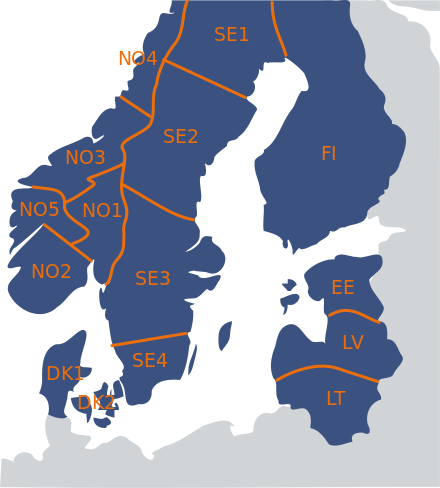
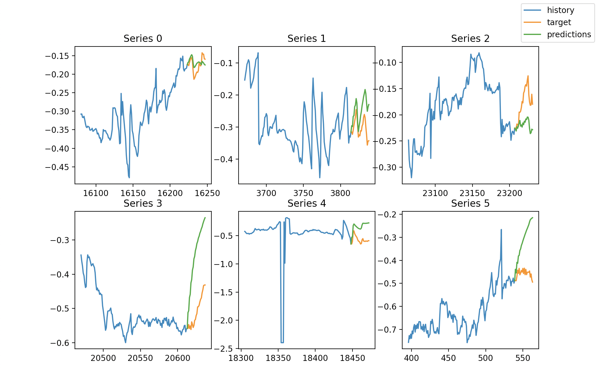
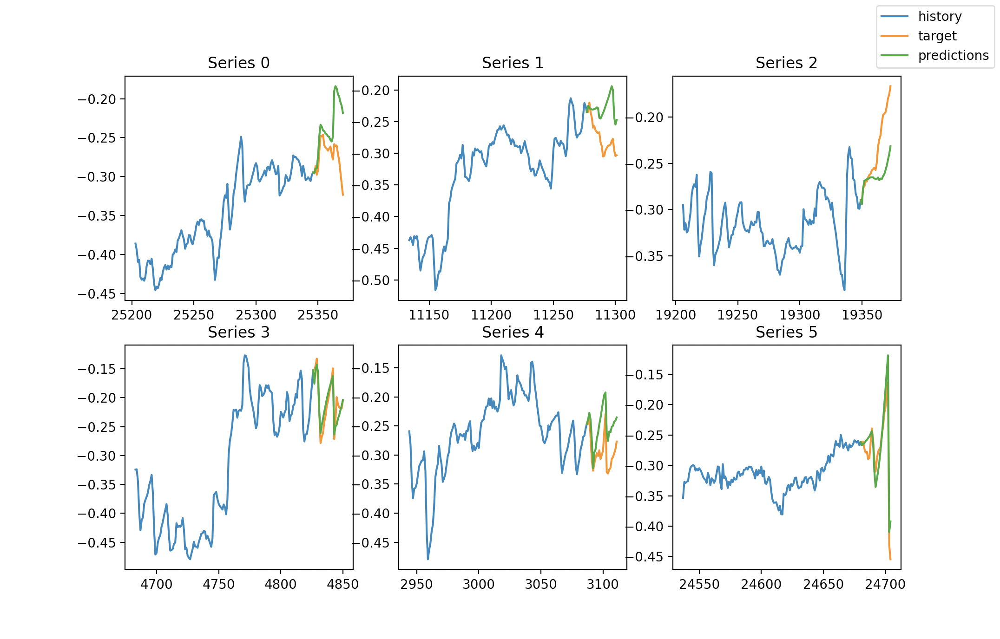

# Time Series Forecasting 📈

This project was part of the Deep Learning (IT3030) course at NTNU spring 2022. The goal of this project was to use time series prediction by training a RNN model to predict transmission system imbalance.

## Installation 📦

To install required packages, use the following command: `pip install -r requirements.txt`

## Running model
You can run the basic model, by running main.py: `python main.py`.
To train a model, change the parameters or run a model trained on altered forecasting, you can change the parameters in the main function in main.py.

## Datasets

The datasets includes production plans and historical imbalance data for east Norway (NO1 area in the figure below).

The datasets contain the following features:

- *start time*: The timestamp of each datum.
- *hydro*: The planned reservoir hydropower production at the time step.
- *micro*: The planned small-scale hydropower production at the time step.
- *river*: The planned run-of-river hydropower production at the time step.
- *thermal*: The planned thermal power plant production at the time step.
- *wind*: The planned wind power plant production at the time step.
- *total*: The total planned production at the time step. Equal to the sum of the listed ”planned production” features.
- *sys reg*: The planned ”system regulation” at the time step: activation of balancing services to accommodate specific needs (e.g. bottlenecks) in the power system.
- *flow*: The planned total power flow in or out of the current area of the grid at the time step.
- *y*: The target variable. The estimated ”open loop” power grid imbalance at the time step. Can be thought of as the imbalance, per area, that would have occurred if balancing services were not activated. It is not possible to observe this value directly, thus it has to be estimated using other measurements of the power grid.

## Results
The results of my experiments with different hyperparameters and features can be found in the [results](results) folder. The folder contains the results and corresponding .txt file explaining the changes made and results.

**Predictions of the model without altered forecasting:**

**Predictions of the model with altered forecasting:**

The models seems to perform best when there are oscillations, and have tendencies to diverge when there are no significant variations. This was expected because of reinforcement of existing bias. Altered forecasting seem to improve the performance.

## Future Work
Future work would concern improving the performance of RNN model.

**Suggestions to improve performance:**
- Adding new features based on external data e.g. weather data.
- Tune hyperparameters even more.
- Modify the network architecture.
