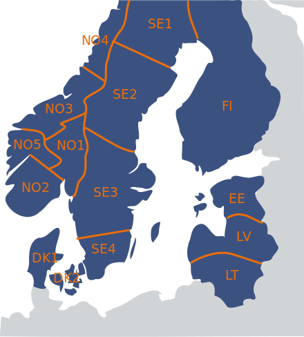

# Time Series Forecasting 📈

This project was part of the Deep Learning (IT3030) course at NTNU spring 2022. The goal of this project was to use time series forecasting to predict transmission system imbalance.

## Installation

To install required packages, use the following command: `pip install -r requirements.txt`

## Datasets

The datasets includes production plans and historical imbalance data for east Norway (NO1 area in the figure below).

